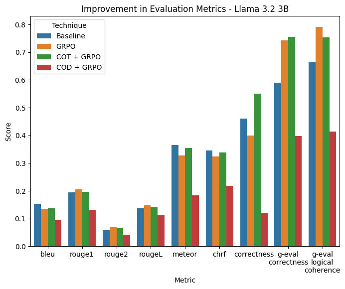
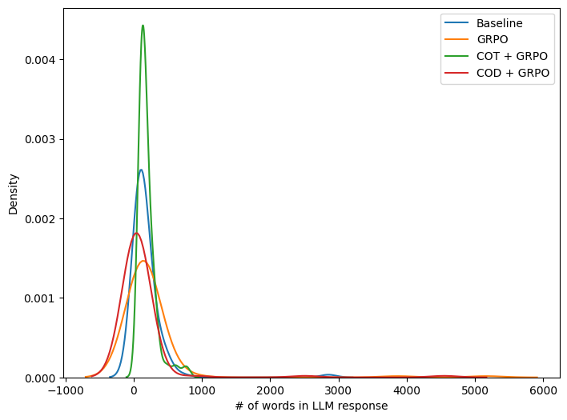
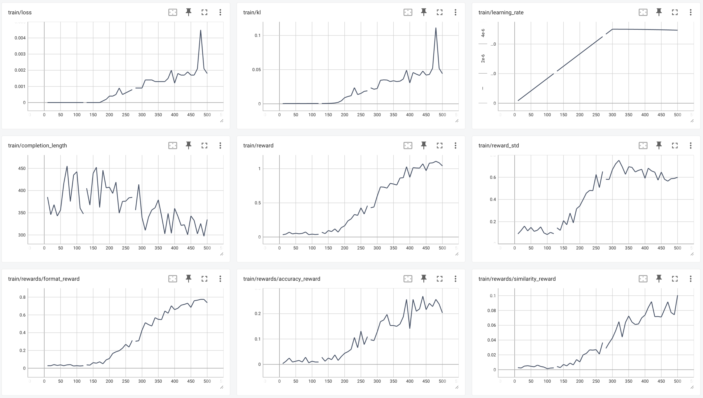
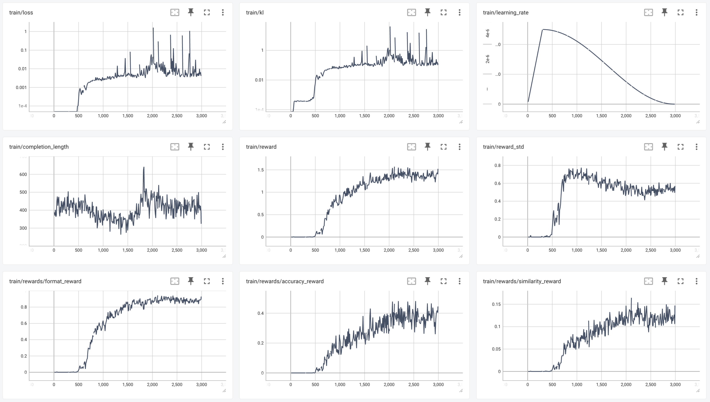
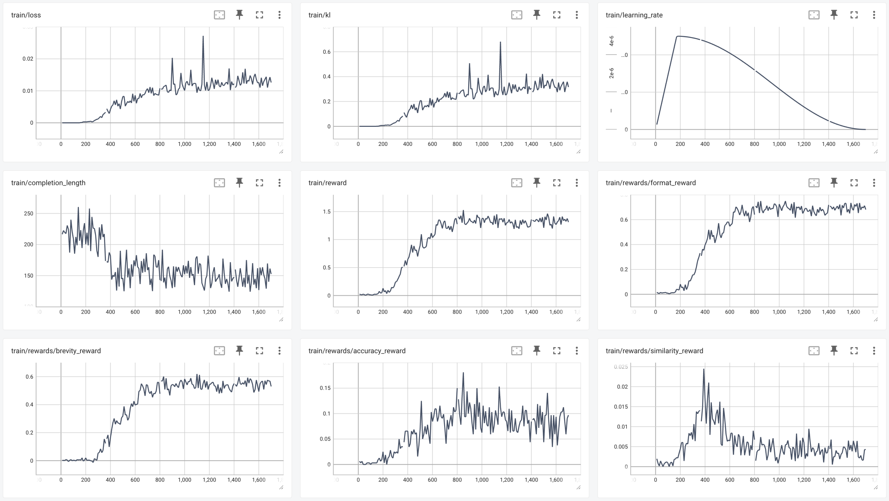
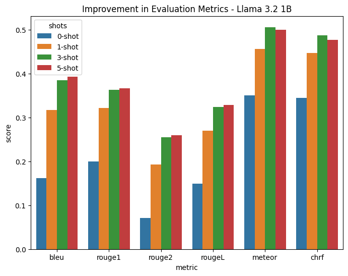

# Specializing Large Language Models using Chain-of-Thought Reasoning

This project explores how reinforcement learning with structured reasoning prompts can specialize a small language model for mathematical problem solving. Three GRPO training strategies — baseline, Chain-of-Thought (CoT), and Chain-of-Density (CoD) — are compared against few-shot prompting baselines across a comprehensive set of evaluation metrics.


## Overview

The project fine-tunes **Llama 3.2 3B Instruct** using **Group Relative Policy Optimization (GRPO)** with different system prompt strategies and reward functions. The goal is to understand whether structured reasoning formats during RL training produce better or more efficient mathematical reasoners.

All variants use parameter-efficient LoRA adapters trained on Google Colab via [Unsloth](https://github.com/unslothai/unsloth).


## Techniques Compared

| Technique | Description |
|---|---|
| Baseline | Zero-shot inference with no fine-tuning |
| GRPO | GRPO fine-tuning with a general `<think>...</think><answer>...</answer>` format |
| CoT + GRPO | GRPO with explicit step-by-step Chain-of-Thought reasoning in the `<think>` block |
| CoD + GRPO | GRPO with Chain-of-Density: compressed (max 5 words per step) drafts in `<think>`, full solution in `<answer>` |
| Few-Shot | In-context learning with 0/1/3/5 retrieved examples via ChromaDB RAG |


## Dataset

**Source:** [MATH Dataset](https://arxiv.org/abs/2103.03874) — competition-level mathematics problems.

The dataset is preprocessed into three CSV splits:

| File | Split |
|---|---|
| `MATH_train_staging.csv` | Training |
| `MATH_val_staging.csv` | Validation |
| `MATH_test_staging.csv` | Test (100 problems for evaluation) |

Each row contains `question_text`, `reasoning` (gold chain-of-thought), and `answer`. Ground-truth answers are extracted using `math_verify` and normalized to handle multiple valid forms (e.g., `-OR-` alternatives).


## Repository Structure

```
.
├── grpo_llama_3b_unsloth.ipynb                    # GRPO training (baseline)
├── grpo_cot_llama_3b_unsloth.ipynb                # GRPO training with CoT prompt
├── grpo_cod_llama_3b_unsloth.ipynb                # GRPO training with CoD prompt
├── grpo_llama_3b_reasoning_inference.ipynb        # Inference and evaluation for GRPO
├── grpo_cot_llama_3b_reasoning_inference.ipynb    # Inference and evaluation for CoT + GRPO
├── grpo_cod_llama_3b_reasoning_inference.ipynb    # Inference and evaluation for CoD + GRPO
├── math_eval_few_shot.ipynb                       # Few-shot evaluation (0/1/3/5 shots)
├── math_eval_few_shot_additional_metrics.ipynb    # Adds METEOR and chrF to few-shot results
├── geval_metrics.ipynb                            # G-Eval LLM-as-judge scoring
├── visualizations.ipynb                           # Result plots and comparisons
├── few-shot-results/                              # CSV outputs from few-shot experiments
├── grpo-results/                                  # CSV outputs from GRPO inference
├── grpo-trained-adapters/                         # Saved LoRA adapter checkpoints
├── math-dataset/                                  # Preprocessed MATH dataset CSV files
├── tensorboard-runs/                              # TensorBoard training logs
├── tutoring-app-ui/                               # Demo tutoring application UI
├── visualizations/                                # Saved result plots
├── final_report.pdf
└── final_poster.pdf
```


## Training

### Model and LoRA Configuration

Base model: `meta-llama/Llama-3.2-3B-Instruct`

```python
model = FastLanguageModel.get_peft_model(
    llm,
    r = 16,
    target_modules = ["gate_proj", "up_proj", "down_proj"],
    lora_alpha = 16,
    use_gradient_checkpointing = "unsloth",
)
```

- 4-bit quantization (`load_in_4bit=True`)
- Max sequence length: 2048 tokens
- Inference backend: vLLM

### Reward Functions

Each training variant uses a combination of reward functions:

**GRPO (Baseline)**

- `format_reward` — returns 1.0 if the response matches `<think>...</think><answer>...</answer>`, else 0
- `accuracy_reward` — returns 1.0 if the extracted answer matches the gold answer via `math_verify`, else 0
- `similarity_reward` — BLEU score of the full response against the gold reasoning

**CoT + GRPO**

Same three rewards as GRPO, but `similarity_reward` scores only the `<think>` block against gold reasoning, encouraging detailed step-by-step thinking.

**CoD + GRPO**

- `format_reward` — same format check
- `accuracy_reward` — same correctness check
- `brevity_reward` — rewards shorter `<think>` blocks: `1 - len(think_block) / len(gold_reasoning)`
- `similarity_reward` — BLEU score of the `<think>` block against gold reasoning

The CoD reward design creates tension between brevity and accuracy, pushing the model to produce compressed but faithful reasoning drafts.

### Hyperparameters

| Parameter | GRPO | CoT + GRPO | CoD + GRPO |
|---|---|---|---|
| Epochs | 2 | 2 | 5 |
| Batch size (per device) | 4 | 8 | 8 |
| Gradient accumulation steps | 4 | 4 | 4 |
| Learning rate | 5e-6 | 5e-6 | 5e-6 |
| LR schedule | Cosine | Cosine | Cosine |
| Warmup ratio | 0.1 | 0.1 | 0.1 |
| Optimizer | paged_adamw_8bit | paged_adamw_8bit | paged_adamw_8bit |
| Max completion length | 10,000 | 10,000 | 10,000 |
| Num generations (GRPO) | 8 | 8 | 8 |
| Max grad norm | 0.1 | 0.1 | 0.1 |


## Few-Shot Baseline

The few-shot experiments use `microsoft/Phi-3.5-mini-instruct` and `mistralai/Mistral-7B-Instruct-v0.3` with retrieval-augmented in-context examples:

- Training examples are indexed in a ChromaDB vector store
- At inference time, the K nearest neighbors to each test question are retrieved and prepended as demonstrations
- K is varied across {0, 1, 3, 5}
- Generation uses greedy decoding (`temperature=0.0`)


## Evaluation

All models are evaluated on the same 100-problem test set.

**Lexical similarity:** BLEU, ROUGE-1, ROUGE-2, ROUGE-L, METEOR, chrF

**Mathematical correctness:** Exact-match via `math_verify`

**LLM-as-judge (G-Eval):**
- G-Eval Correctness — LLM-based scoring of mathematical correctness
- G-Eval Logical Coherence — LLM-based scoring of reasoning quality


## Results

### GRPO Variants vs. Baseline (Llama 3.2 3B)



| Metric | Baseline | GRPO | CoT + GRPO | CoD + GRPO |
|---|---|---|---|---|
| BLEU | 0.16 | 0.14 | 0.15 | 0.10 |
| ROUGE-1 | 0.20 | 0.20 | 0.20 | 0.13 |
| ROUGE-2 | 0.06 | 0.07 | 0.07 | 0.05 |
| ROUGE-L | 0.14 | 0.15 | 0.15 | 0.11 |
| METEOR | 0.37 | 0.33 | 0.35 | 0.19 |
| chrF | 0.35 | 0.33 | 0.34 | 0.22 |
| Correctness | 0.46 | 0.40 | 0.55 | 0.12 |
| G-Eval Correctness | 0.60 | 0.75 | 0.75 | 0.40 |
| G-Eval Logical Coherence | 0.65 | 0.79 | 0.75 | 0.41 |

Key findings:
- CoT + GRPO achieves the highest exact-match correctness (0.55), outperforming both the baseline and vanilla GRPO
- GRPO and CoT + GRPO match on G-Eval correctness (0.75) and produce the most logically coherent responses
- CoD + GRPO underperforms across all metrics — the brevity constraint is too aggressive for this model scale
- GRPO training increases response verbosity significantly; CoD compresses it back down

### Response Length Distribution



CoT + GRPO produces the longest responses; CoD + GRPO produces the most concise, concentrated near zero words.

### Training Curves

GRPO Baseline



CoT + GRPO



CoD + GRPO



All three models show steadily increasing `format_reward` and `accuracy_reward` across training steps.

### Few-Shot Results



Scaling from 0-shot to 3-shot consistently improves all lexical metrics, with diminishing returns beyond 3 shots.


## Getting Started

This project runs on Google Colab with a GPU runtime (A100 recommended for GRPO training).

**Install dependencies**

```bash
pip install trl math_verify evaluate vllm==0.8.2 unsloth
pip install peft flash-attn rouge_score sentencepiece sacrebleu chromadb
```

**Dataset setup**

Place the three staging CSV files in your working directory or Google Drive:
- `MATH_train_staging.csv`
- `MATH_val_staging.csv`
- `MATH_test_staging.csv`

**Training**

Open the relevant training notebook in Colab and run all cells. Adapters are saved automatically.

**Inference**

Load the saved LoRA adapter using PEFT and run the corresponding inference notebook:

```python
from peft import PeftModel
import transformers

llm = transformers.AutoModelForCausalLM.from_pretrained(
    "meta-llama/Llama-3.2-3B-Instruct",
    torch_dtype="auto",
    attn_implementation="flash_attention_2",
)
model = PeftModel.from_pretrained(llm, "path/to/saved/adapter")
model.eval()
```


## Requirements

```
python >= 3.10
torch
transformers
trl
unsloth
vllm==0.8.2
peft
flash-attn
math_verify
evaluate
chromadb
datasets
pandas
matplotlib
seaborn
sacrebleu
rouge_score
sentencepiece
```


## References

- Wei et al. (2022). Chain-of-Thought Prompting Elicits Reasoning in Large Language Models. NeurIPS 2022. https://arxiv.org/abs/2201.11903
- Shao et al. (2024). DeepSeekMath: Pushing the Limits of Mathematical Reasoning in Open Language Models. https://arxiv.org/abs/2402.03300
- Adams et al. (2023). From Sparse to Dense: GPT-4 Summarization with Chain of Density Prompting. https://arxiv.org/abs/2309.04269
- Hendrycks et al. (2021). Measuring Mathematical Problem Solving With the MATH Dataset. https://arxiv.org/abs/2103.03874
- Unsloth: https://github.com/unslothai/unsloth


